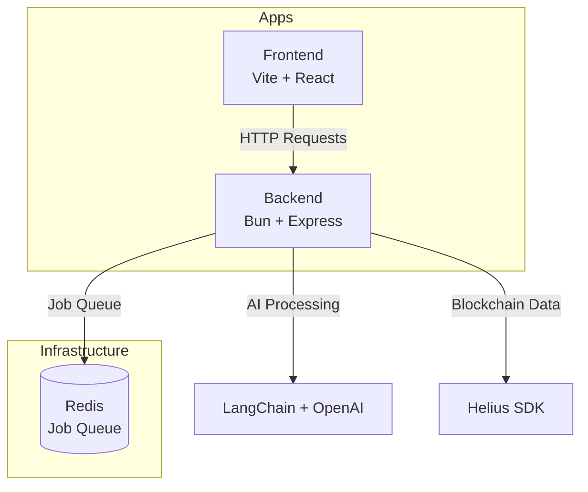

# SolSentry

A monorepo for SolSentry - a Solana blockchain visualization and analysis platform powered by AI.

## Architecture

This project uses [Turborepo](https://turbo.build/repo) to manage a monorepo with the following apps:



### Apps

- **`apps/frontend`**: React application built with Vite
  - Modern UI with glassmorphism design
  - Code visualization interface
  - Job status tracking
  
- **`apps/backend`**: Express API server running on Bun
  - LangChain integration for AI-powered queries
  - BullMQ job queue with Redis
  - Helius SDK for Solana blockchain data
  - Custom query examples

## Getting Started

### Prerequisites

- [Bun](https://bun.sh/) (v1.0.0 or higher)
- [Docker](https://www.docker.com/) (for Redis)
- Node.js 18+ (for Turborepo compatibility)

### Installation

1. Clone the repository:
   ```bash
   git clone <repository-url>
   cd solSentry
   ```

2. Install dependencies:
   ```bash
   bun install
   ```

3. Set up environment variables:
   ```bash
   # Backend
   cp apps/backend/.env.example apps/backend/.env
   # Edit apps/backend/.env with your API keys
   ```

4. Start Redis:
   ```bash
   docker compose up -d
   ```

### Development

Run both frontend and backend in development mode:

```bash
bun run dev
```

Or run individual apps:

```bash
# Frontend only
bun run dev --filter=frontend

# Backend only
bun run dev --filter=solscan
```

### Backend-Specific Commands

```bash
# Start the API server
cd apps/backend
bun run server

# Start the job worker
bun run worker

# Run custom query examples
bun run query
```

### Build

Build all apps:

```bash
bun run build
```

Build specific app:

```bash
bun run build --filter=frontend
```

### Lint

Lint all apps:

```bash
bun run lint
```

## Project Structure

```
solSentry/
├── apps/
│   ├── backend/          # Express API + BullMQ workers
│   │   ├── src/
│   │   ├── examples/
│   │   └── package.json
│   └── frontend/         # Vite + React app
│       ├── src/
│       ├── public/
│       └── package.json
├── docker-compose.yml    # Redis service
├── turbo.json           # Turborepo configuration
└── package.json         # Root workspace config
```

## Tech Stack

### Frontend
- React 19
- Vite
- TypeScript
- CSS (with modern design patterns)

### Backend
- Bun runtime
- Express 5
- BullMQ (job queue)
- LangChain (AI integration)
- Helius SDK (Solana data)
- TypeScript

### Infrastructure
- Redis (job queue)
- Docker (containerization)
- Turborepo (monorepo management)

## Learn More

- [Turborepo Documentation](https://turbo.build/repo/docs)
- [Bun Documentation](https://bun.sh/docs)
- [LangChain Documentation](https://js.langchain.com/)
- [Helius SDK](https://docs.helius.dev/)

## License

Private - All rights reserved
